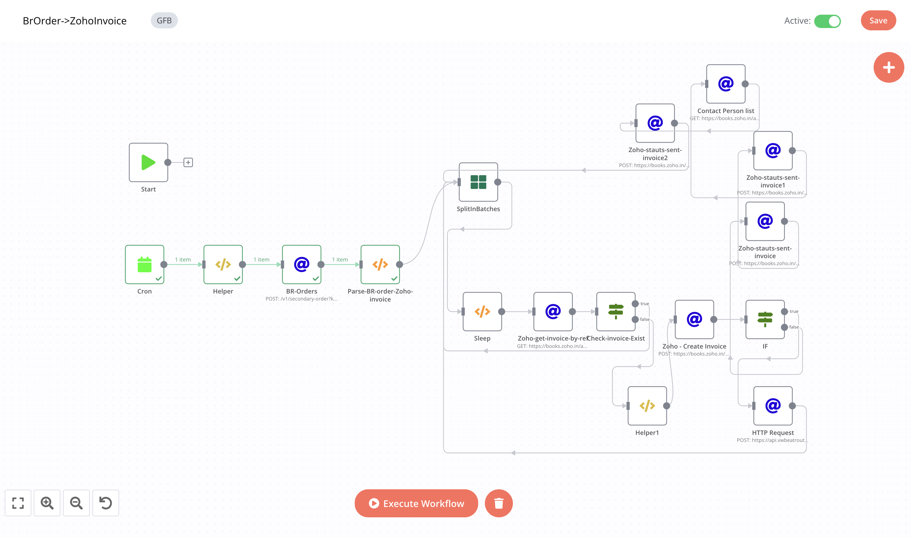

# Beatroute Orders->Zoho Invoice

### Feature

- [x] sync every 75 minutes(you can change it)
- [x] Fetch BR orders of last 75 days and then get invoices for each order from zoho apis.
- [x] If invoice not found the create a new invoice against each order and sent status to the custumer's mobile number .

### Flows

1- Fetch BR orders of past 75 minutes:

```javascript

{{$node["Helper"].json.brBaseUrl}}/v1/secondary-order?key={{$node["Helper"].json.token}}&date={{$node["Helper"].json["filterDate"]}}
```

2- Return single orders using JS functions and add additional data into it.

```javascript
function formatDate(format, dateString = null){
    var date = new Date();
    if(dateString){
        date = new Date(dateString);
    }
    var mm = date.getMonth() + 1;
    var dd = date.getDate();
    var yyyy = date.getFullYear();

    const map = {
        mm: mm > 9 ? mm : "0" + mm.toString(),
        dd: dd > 9 ? dd : "0" + dd.toString(),
        yyyy: yyyy
    }
    
    return format.replace(/mm|dd|yyyy/gi, matched => map[matched]);
}

var brOrders = $node["BR-Orders"].json["data"]["items"];
if(!brOrders){
    return [];
}

var returnData = [];
brOrders.forEach(order => {
    var createdDate = formatDate("yyyy-mm-dd", order.dateTime);
    var orderDetails = [];
    var totalDiscount = 0;
    order.details.forEach(detail => {
        orderDetails.push({
            "item_id": detail.sku_erp_id,
            "rate": detail.base_price,
            "quantity": detail.quantity,
        });
        totalDiscount += detail.discount > 0 ? ((parseFloat(detail.base_price) * parseFloat(detail.quantity)) * parseFloat(detail.discount) / 100) : parseFloat(detail.discount);
    });

    returnData.push({
        json: {
            "retailer_erp_id":order.retailer_erp_id,
            "customer_id": order.retailer_erp_id,
            "branch_id":order.distributor_erp_id.trim(),
            "date": createdDate,
            "line_items": orderDetails,
            "reference_number": order.orderId,
            "salesperson_name": order.added_by_name,
            "status": "sent",
            "is_inclusive_tax": true,
            "is_discount_before_tax": false,
            "discount": totalDiscount,
            "discount_type": "entity_level",
            "tax_id" :"",
            "payment_options": {
              "payment_gateways": [
                {
                  "gateway_name": "paytm"
                }
              ]
            }
        }
    });
});
return returnData;
```

3 - Fetch invoice using refernce number

```javascript
  https://books.zoho.in/api/v3/invoices?organization_id={{$node["Helper"].json["zohoOrgId"]}}&reference_number={{$node["SplitInBatches"].json["reference_number"]}}
```

4-  If invoice is created in Zoho then create a new one by following below step else goes back to fetch next order.

5- Create Invoice.

```javascript
https://books.zoho.in/api/v3/invoices?organization_id={{$node["Helper1"].json["zohoOrgId"]}}&send=true
```
  - In Body :
  ```javascript
  {{$node["SplitInBatches"].json}}
  ```
  
6- Update the status on BeatRoute of that order using below api:

```javascript
{{$node["Helper"].json.brBaseUrl}}/v1/secondary-order/update-status?key={{$node["Helper"].json.token}}}}
```
    - In Body :
   ```javascript
{
"order_id":{{$node["SplitInBatches"].json["reference_number"]}},
"order_status":"Cancelled"
}
    ```

7 - Call Approve  status from Zoho api:

```javascript
https://books.zoho.in/api/v3/invoices/{{$node["Zoho - Create Invoice"].json["invoice"]["invoice_id"]}}/approve?organization_id={{$node["Helper"].json["zohoOrgId"]}}
```

8 - Sent Status to its respective invoice_id:

```javascript
https://books.zoho.in/api/v3/invoices/{{$node["Zoho - Create Invoice"].json["invoice"]["invoice_id"]}}/status/sent?organization_id=60006243763
```

9 - Get Fetch Contact person details:

```
https://books.zoho.in/api/v3/contacts/{{$node["SplitInBatches"].json["retailer_erp_id"]}}/contactpersons?organization_id=60006243763
```

10 - Sent invoice to respective contact person through SMS:
```javascript
https://books.zoho.in/api/v3/invoices/{{$node["Zoho - Create Invoice"].json["invoice"]["invoice_id"]}}/sms?organization_id=60006243763
```

## Workflow

[On Click on this, you will be redirected to workflow](https://int.beatroute.io/workflow/41)

To call Zoho Apis we need to integrate Zoho's 0Auth token:

 1- OAuth Redirect URL:
   > https://int.beatroute.io/rest/oauth2-credential/callback
   
 2- Authorization URL:
   > https://accounts.zoho.in/oauth/v2/auth?

 3- Access Token URL:
   > https://accounts.zoho.in/oauth/v2/token?
   
 4- Client ID:
   > 1000.XNHV0LXKCZNQ92CV1WV6GADZVXJ4CC

 5- Client Secret 
   > f6ff767160b8a63aa8e16e85bf356ee5971270dd01
 
 6- Scope
   > ZohoBooks.fullaccess.all

 7- Auth URI Query Parameters
   > access_type=offline


