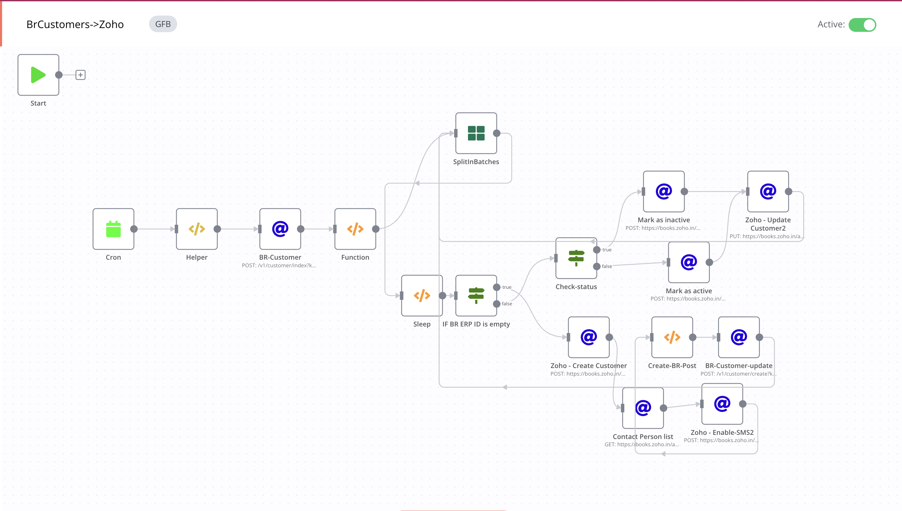

# Beatroute Customer->Zoho

### Feature

- [x] sync every 60 minutes(you can change it)
- [x] Fetch BR Customers of last 60 days and if ERP_ID is present then check its status by calling Zoho's Contact api as per its status and simultaneously update that customer in Zoho
- [x] If ERP_ID is empty then create customer in Zoho and enable SMS and then simultaneously Update data in BR.

### Flows

1- Fetch BR Customer of past 75 minutes:

```javascript

{{$node["Helper"].json.brBaseUrl}}/v1/customer/index?key={{$node["Helper"].json.token}}&date={{$node["Helper"].json["currentDate"]}}
```

2- Return single customer using JS functions and add additional data into it.

```javascript
var brCustomers = $node["BR-Customer"].json["data"]["items"];
if(!brCustomers){
    return [];
}

var returnData = [];
brCustomers.forEach(customer => {
if(true){
    var contactpersonArr = customer.contact_person ? customer.contact_person.split(" ") : [];
    var firstName = contactpersonArr[0];
    contactpersonArr.splice(0, 1);
    var lastName = contactpersonArr.join(" ");
    var createdDate = new Date(Date.parse(customer.created_date)).toISOString();
    var modifiedDate = customer.modified_date ? new Date(Date.parse(customer.created_date)).toISOString() : "";

    var customFields = [];
    if(customer.customFields){
        customer.customFields.forEach(cField => {
            customFields.push({
                "index": cField.labelID,
                "value": cField.value,
                "label": cField.labelName
            });
        });
    }
    returnData.push({
        json: {
            "br_id": customer.id,
            "erp_id": customer.external_id,
            "contact_name": "Retail " + customer.name,
            "email": customer.email,
            "phone": customer.mobile,
            "first_name": firstName,
            "last_name": lastName,
            "contact_type": "customer",
            "customer_sub_type": "business",
            "route_id":customer.route_id,
            "billing_address": {
                "address": customer.locality,
                "street2": customer.street,
                "city": customer.city,
                "state": customer.state,
                "zip": customer.pincode,
                "country": customer.country,
                "fax": customer.fax
            },
             "contact_persons": [
            {
            "mobile": customer.mobile,
            }],
            "shipping_address": {
                "address": customer.locality,
                "street2": customer.street,
                "city": customer.city,
                "state": customer.state,
                "zip": customer.pincode,
                "country": customer.country,
                "fax": customer.fax,
                "latitude": customer.latitude,
                "longitude": customer.longitude
            },
            "created_time": createdDate,
            "last_modified_time": modifiedDate,
            "status":"1"?"active":"inactive"
        }
    });
    }
});
return returnData;

```

3-  If ERP_ID is not empty then it will follow below steps:
- Check Customer's Status, if it is active then call below api:
  - https://books.zoho.in/api/v3/contacts/{{$node["SplitInBatches"].json["erp_id"]}}/active?organization_id={{$node["Helper"].json["zohoOrgId"]}}
  
- If it is inactive:
  - https://books.zoho.in/api/v3/contacts/{{$node["SplitInBatches"].json["erp_id"]}}/inactive?organization_id={{$node["Helper"].json["zohoOrgId"]}}
        
- Update Customer in Zoho:
  - https://books.zoho.in/api/v3/contacts/{{$node["SplitInBatches"].json["erp_id"]}}?organization_id={{$node["Helper"].json["zohoOrgId"]}}
     
      ##### Body: 
      > {{$node["SplitInBatches"].json}}

4- If ERP_ID is empty then Create Customer in Zoho:

```javascript
https://books.zoho.in/api/v3/contacts?organization_id={{$node["Helper"].json["zohoOrgId"]}}
```
  - In Body :
  ```javascript
  {{$node["SplitInBatches"].json}}
  ```
  
5- Update the status on BeatRoute of that order using below api:

```javascript
https://books.zoho.in/api/v3/contacts?organization_id={{$node["Helper"].json["zohoOrgId"]}}
```
    - In Body :
   ```javascript
{{$node["SplitInBatches"].json}}
    ```

6 - Get Contact Person List:

```javascript
https://books.zoho.in/api/v3/contacts/{{$node["Zoho - Create Customer"].json["contact"]["contact_id"]}}/contactpersons?organization_id={{$node["Helper"].json["zohoOrgId"]}}
```

7 - Enable SMS:

```javascript
https://books.zoho.in/api/v3/contacts/contactpersons/{{$node["Contact Person list"].json["contact_persons"][0]["contact_person_id"]}}/sms/enable?organization_id={{$node["Helper"].json["zohoOrgId"]}}
```
    - In Body:
    ```javascript
    {"contact_id":"{{$node["Zoho - Create Customer"].json["contact"]["contact_id"]}}"}
    ```

## Workflow

[On Click on this, you will be redirected to workflow](https://int.beatroute.io/workflow/4)

To call Zoho Apis we need to integrate Zoho's 0Auth token:

 1- OAuth Redirect URL:
   > https://int.beatroute.io/rest/oauth2-credential/callback
   
 2- Authorization URL:
   > https://accounts.zoho.in/oauth/v2/auth?

 3- Access Token URL:
   > https://accounts.zoho.in/oauth/v2/token?
   
 4- Client ID:
   > 1000.XNHV0LXKCZNQ92CV1WV6GADZVXJ4CC

 5- Client Secret 
   > f6ff767160b8a63aa8e16e85bf356ee5971270dd01
 
 6- Scope
   > ZohoBooks.fullaccess.all

 7- Auth URI Query Parameters
   > access_type=offline


