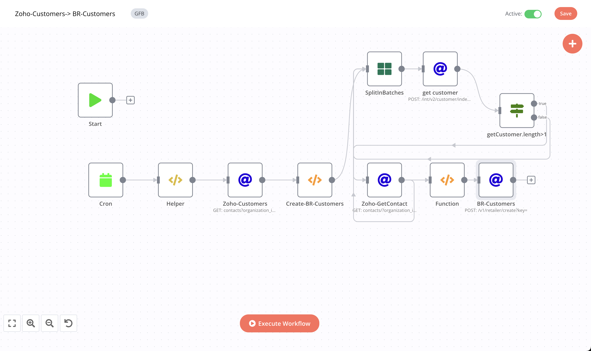

# Zoho-Customer->BR-Customer

### Feature

- [x] sync every 2 hours(you can change it)
- [x] Fetch Zoho Customers and then update its credit limit, route_id,status then save it update BR database.

### Flows

1- Fetch Zoho Customer of past 120 minutes:

```javascript

{{$node["Helper"].json.zohoBaseUrl}}contacts?organization_id={{$node["Helper"].json["zohoOrgId"]}}&sort_column=last_modified_time&sort_order=D
```

2- Return single customer using JS functions and add additional data into it.

```javascript
var zohoCustomer = $node["Zoho-Customers"].json["contacts"];
var returnData = [];
zohoCustomer.forEach(data=> {
   returnData.push({
                json: {
                      "contact_id": data.contact_id,                                           
                      } 
                 });
});
  return returnData; 
```


3- Fetch BR Customer:

```javascript
{{$node["Helper"].json["brBaseUrl"]}}/int/v2/customer/index?key={{$node["Helper"].json["token"]}}
```
  - In Body :
  ```javascript
  {
 "search": {
 "retailer_external_id":{{$node["SplitInBatches"].json["contact_id"]}}
 }
}
  ```
  
5- If Customer existed in Beatroute system the call Zoho Contact api:

```javascript
{{$node["Helper"].json.zohoBaseUrl}}contacts/{{$node["SplitInBatches"].json["contact_id"]}}?organization_id={{$node["Helper"].json["zohoOrgId"]}}
```

6 -Update Customer Credit Limit, Route Id and Status:

```javascript
var erp_id = $node["SplitInBatches"].json;
var zsplit = $node["Zoho-GetContact"].json['contact'];
var route_id = $node["get customer"].json['data'];
var returnData = [];

   returnData.push({
                json: {
                      "credit_limit": zsplit.credit_limit,
                      "erp_id":zsplit.contact_id,
                      "status":zsplit.status==="inactive"?"2":"1" ,
                      "route_id": route_id[0]?.route_id                         
                      } 
                 });

  return returnData; 
```

7 - Update Beatroute Customer:

```javascript
{{$node["Helper"].json.brBaseUrl}}/v1/retailer/create?key={{$node["Helper"].json.token}}
```
    - In Body:
    ```javascript
   {{$node["Function"].json}}
    ```

## Workflow

[On Click on this, you will be redirected to workflow](https://int.beatroute.io/workflow/26)

To call Zoho Apis we need to integrate Zoho's 0Auth token:

 1- OAuth Redirect URL:
   > https://int.beatroute.io/rest/oauth2-credential/callback
   
 2- Authorization URL:
   > https://accounts.zoho.in/oauth/v2/auth?

 3- Access Token URL:
   > https://accounts.zoho.in/oauth/v2/token?
   
 4- Client ID:
   > 1000.XNHV0LXKCZNQ92CV1WV6GADZVXJ4CC

 5- Client Secret 
   > f6ff767160b8a63aa8e16e85bf356ee5971270dd01
 
 6- Scope
   > ZohoBooks.fullaccess.all

 7- Auth URI Query Parameters
   > access_type=offline


