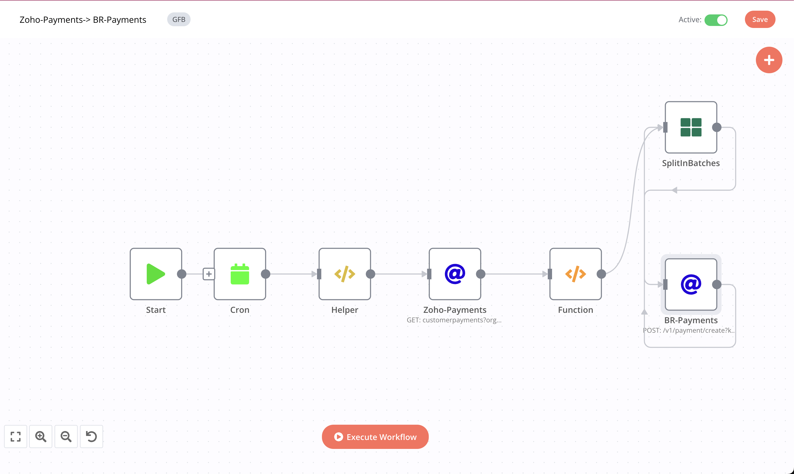

# Zoho-Payments->BR-Payments

### Feature

- [x] sync every 105 minutes(you can change it)
- [x] Fetch Zoho Paymemts and then update it in BR database.

### Flows

1- Fetch Zoho Payments of past 105 minutes:

```javascript

{{$node["Helper"].json.zohoBaseUrl}}customerpayments?organization_id={{$node["Helper"].json["zohoOrgId"]}}&sort_column=date&sort_order=D
```

2- Return single element using JS functions and add additional data into it.

```javascript
var scheduleMinGap = 3;
function formatDate(format, dateString = null){
date = new Date(new Date(dateString).getTime() + (scheduleMinGap * 60000));

 var mm = date.getMonth() + 1;
  var dd= date.getDate();
  var yyyy= date.getFullYear();
  var hh= date.getHours();
  var ii= date.getMinutes();
  var ss= date.getSeconds();

    const map = {
        mm: mm > 9 ? mm : "0" + mm.toString(),
        dd: dd > 9 ? dd : "0" + dd.toString(),
        yyyy: yyyy,
        hh: hh > 9 ? hh : "0" + hh.toString(),
        ii: ii > 9 ? ii : "0" + ii.toString(),
        ss: ss > 9 ? ss : "0" + ss.toString()
    }
    
    return format.replace(/mm|dd|yyyy|hh|ii|ss/gi, matched => map[matched]);
}

var zohoPayments = $node["Zoho-Payments"].json["customerpayments"];
var returnData = [];
zohoPayments.forEach(data=> {
   returnData.push({
                json: {
                      "payment_erp_id": data.payment_id,
                      "distributor_erp_id":data.branch_id,
                      "customer_erp_id":data.customer_id,
                      "erp_invoice_number":data.invoice_numbers || "",
                      "amount":data.amount,
                      "mode":data.payment_mode,
                      "payment_date":data.date,
                      "approved_at":formatDate("yyyy-mm-dd hh:ii:ss",data.created_time )                                      
                      } 
                 });
});
  return returnData; 
```


3- Create payements in BeatRoute:

```javascript
{{$node["Helper"].json.brBaseUrl}}/v1/payment/create?key={{$node["Helper"].json.token}}
```
  - In Body :
  ```javascript
  {{$node["SplitInBatches"].json}}
  ```
 
## Workflow

[On Click on this, you will be redirected to workflow](https://int.beatroute.io/workflow/27)

To call Zoho Apis we need to integrate Zoho's 0Auth token:

 1- OAuth Redirect URL:
   > https://int.beatroute.io/rest/oauth2-credential/callback
   
 2- Authorization URL:
   > https://accounts.zoho.in/oauth/v2/auth?

 3- Access Token URL:
   > https://accounts.zoho.in/oauth/v2/token?
   
 4- Client ID:
   > 1000.XNHV0LXKCZNQ92CV1WV6GADZVXJ4CC

 5- Client Secret 
   > f6ff767160b8a63aa8e16e85bf356ee5971270dd01
 
 6- Scope
   > ZohoBooks.fullaccess.all

 7- Auth URI Query Parameters
   > access_type=offline


