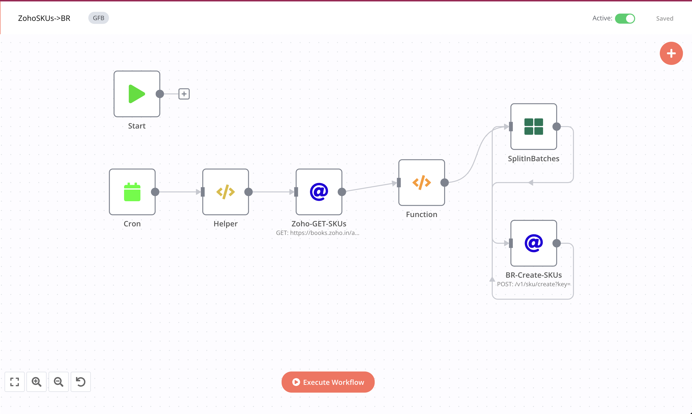

# Zoho-Sku->BR

### Feature

- [x] sync every 24 hours(you can change it)
- [x] Fetch Zoho Skus and then update it in BR database.

### Flows

1- Fetch Zoho Skus of past 24 hours:

```javascript

https://books.zoho.in/api/v3/items?organization_id={{$node["Helper"].json["zohoOrgId"]}}
```

2- Return single element using JS functions and add additional data into it.

```javascript
function formatDate(format, dateString = null){
    var date = new Date();
    if(dateString){
        date = new Date(dateString);
    }
    var mm = date.getMonth() + 1;
    var dd = date.getDate();
    var yyyy = date.getFullYear();
    var h= date.getHours();
    var i= date.getMinutes();
    var s= date.getSeconds();

    const map = {
        mm: mm > 9 ? mm : "0" + mm.toString(),
        dd: dd > 9 ? dd : "0" + dd.toString(),
        yyyy: yyyy,
        h: h > 9 ? h : "0" + h.toString(),
        i: i > 9 ? i : "0" + i.toString(),
        s: s > 9 ? s : "0" + s.toString(),
    }
    
    return format.replace(/mm|dd|yyyy|h|i|s/gi, matched => map[matched]);
}

var zohoSkus = $node["Zoho-GET-SKUs"].json["items"];
if(!zohoSkus){
    return [];
}

var returnData = [];
zohoSkus.forEach(sku => {
    var createdDate = formatDate("yyyy-mm-dd h:i:s", sku.created_time);
  

    returnData.push({
        json: {
            "sku_erp_id": sku.item_id,
            "description": sku.item_name,
            "uom": sku.unit,
            "type": "sku",
            "detail_description": sku.description,
            "is_available": 1
        }
    });

});
return returnData;
```


3- Create Skus in BeatRoute:

```javascript
{{$node["Helper"].json.brBaseUrl}}/v1/sku/create?key={{$node["Helper"].json.token}}
```
  - In Body :
  ```javascript
  {{$node["SplitInBatches"].json}}
  ```
 
## Workflow

[On Click on this, you will be redirected to workflow](https://int.beatroute.io/workflow/8)

To call Zoho Apis we need to integrate Zoho's 0Auth token:

 1- OAuth Redirect URL:
   > https://int.beatroute.io/rest/oauth2-credential/callback
   
 2- Authorization URL:
   > https://accounts.zoho.in/oauth/v2/auth?

 3- Access Token URL:
   > https://accounts.zoho.in/oauth/v2/token?
   
 4- Client ID:
   > 1000.XNHV0LXKCZNQ92CV1WV6GADZVXJ4CC

 5- Client Secret 
   > f6ff767160b8a63aa8e16e85bf356ee5971270dd01
 
 6- Scope
   > ZohoBooks.fullaccess.all

 7- Auth URI Query Parameters
   > access_type=offline


