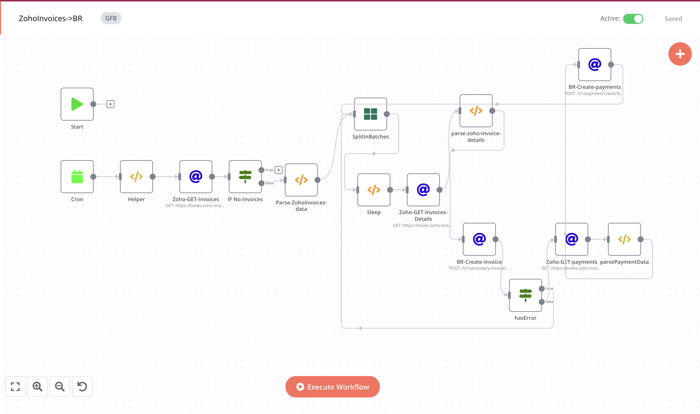

# Zoho-Invoice->BR-Invoice

### Feature

- [x] sync every 90 minutes(you can change it)
- [x] Fetch Zoho Invoices and then fetch all the details against each invoices and Create invoices in            Beatroute.
- [x] Get Payments for each invoices and simultaneously save it is Beatroute payments 

### Flows

1- Fetch Zoho Invoices of past 90 minutes:

```javascript

https://books.zoho.in/api/v3/invoices?organization_id={{$node["Helper"].json["zohoOrgId"]}}&date={{$node["Helper"].json["filterDate"]}}
```

2- Return `invoice_id` from invoices using JS functions.

```javascript
function formatDate(format, dateString = null){
    var date = new Date();
    if(dateString){
        date = new Date(dateString);
    }
    var mm = date.getMonth() + 1;
    var dd = date.getDate();
    var yyyy = date.getFullYear();
    var h= date.getHours();
    var i= date.getMinutes();
    var s= date.getSeconds();

    const map = {
        mm: mm > 9 ? mm : "0" + mm.toString(),
        dd: dd > 9 ? dd : "0" + dd.toString(),
        yyyy: yyyy,
        h: h > 9 ? h : "0" + h.toString(),
        i: i > 9 ? i : "0" + i.toString(),
        s: s > 9 ? s : "0" + s.toString(),
    }
    
    return format.replace(/mm|dd|yyyy|h|i|s/gi, matched => map[matched]);
}

var zohoInvoices = $node["Zoho-GET-Invoices"].json["invoices"];
if(!zohoInvoices){
    return [];
}

var returnData = [];
zohoInvoices.forEach(invoice => {
    returnData.push({
  
        json: {
            "invoice_id": invoice.invoice_id
        }
       
    });
});
return returnData;
```


3- Fetch invoice details against its `invoice id`:

```javascript
https://books.zoho.in/api/v3/invoices/{{$node["SplitInBatches"].json["invoice_id"]}}?organization_id={{$node["Helper"].json["zohoOrgId"]}}
```
  - In Body :
  ```javascript
  {{$node["SplitInBatches"].json}}
  ```
  
4- Return single element using JS functions and add additional data into it.

```javascript
function formatDate(format, dateString = null){
    var date = new Date();
    if(dateString){
        date = new Date(dateString);
    }
    var mm = date.getMonth() + 1;
    var dd = date.getDate();
    var yyyy = date.getFullYear();
    var h= date.getHours();
    var i= date.getMinutes();
    var s= date.getSeconds();

    const map = {
        mm: mm > 9 ? mm : "0" + mm.toString(),
        dd: dd > 9 ? dd : "0" + dd.toString(),
        yyyy: yyyy,
        h: h > 9 ? h : "0" + h.toString(),
        i: i > 9 ? i : "0" + i.toString(),
        s: s > 9 ? s : "0" + s.toString(),
    }
    
    return format.replace(/mm|dd|yyyy|h|i|s/gi, matched => map[matched]);
}

var zohoInvoice = $node["Zoho-GET-Invoices-Details"].json.invoice;
if(!zohoInvoice){
    return {};
}

var invoiceDate = formatDate("yyyy-mm-dd h:i:s", zohoInvoice.date);
var distributorErpId = $node["Helper"].json["distributorErpId"];

var invoiceDetails = {item: []};
zohoInvoice.line_items.forEach(item => {
    invoiceDetails.item.push({
        "sku": item.item_id,
        "quantity": item.quantity,
        "price_per_item": item.rate,
        "discount_value": item.discount_amount,
        "gross_value": item.item_total,
    });
});
var orderId = zohoInvoice.reference_number;
return [
    { 
        "json": [{
            "distributor_erp_id": zohoInvoice.branch_id,
            "customer_erp_id": zohoInvoice.customer_id,
            "order_id": orderId,
            "total_value": zohoInvoice.total,
            "total_tax": 0,
            "erp_invoice_number": zohoInvoice.invoice_number,
            "invoice_date": invoiceDate,
            "status": 1,
            "order_status": "Completed",
            "details": invoiceDetails
        }]
    }
];

```

5- Create it in BeatRoute Database:
```javascript
{{$node["Helper"].json.brBaseUrl}}/v1/secondary-invoice/create?key={{$node["Helper"].json.token}}
```
  ##### Body:
  > {{$node["parse-zoho-invoice-details"].json}}
  
6- If there is no error the get payments of each invoice using Zoho apis:

```javascript
https://books.zoho.in/api/v3/invoices/{{$node["Zoho-GET-Invoices-Details"].json.invoice.invoice_id}}/payments?organization_id={{$node["Helper"].json["zohoOrgId"]}}
```

  
7- Return single element using JS functions and add additional data into it.

```javascript
function formatDate(format, dateString = null){
    var date = new Date();
    if(dateString){
        date = new Date(dateString);
    }
    var mm = date.getMonth() + 1;
    var dd = date.getDate();
    var yyyy = date.getFullYear();
    var h= date.getHours();
    var i= date.getMinutes();
    var s= date.getSeconds();

    const map = {
        mm: mm > 9 ? mm : "0" + mm.toString(),
        dd: dd > 9 ? dd : "0" + dd.toString(),
        yyyy: yyyy,
        h: h > 9 ? h : "0" + h.toString(),
        i: i > 9 ? i : "0" + i.toString(),
        s: s > 9 ? s : "0" + s.toString(),
    }
    
    return format.replace(/mm|dd|yyyy|h|i|s/gi, matched => map[matched]);
}

var zohoPayments = $node["Zoho-GET-payments"].json.payments;

if(!zohoPayments){
    return {};
}
var customerErpId = $node["parse-zoho-invoice-details"].json[0].customer_erp_id;
var zohoInvoice = $node["Zoho-GET-Invoices-Details"].json.invoice;
var returnData = [];
zohoPayments.forEach(payment => {
    var paymentDate = formatDate("yyyy-mm-dd h:i:s", payment.date);    
    returnData.push(
       {
                "customer_erp_id": customerErpId,
                "distributor_erp_id": zohoInvoice.branch_id,
                "erp_invoice_number": zohoInvoice.invoice_number,
                "mode": payment.payment_mode,
                "amount": payment.amount,
                "payment_date": paymentDate,
                "remarks": payment.description,
                "payment_erp_id": payment.payment_id,
                "approved_at": paymentDate
        }
    );
});

return returnData;

```
9- Create Payments in Zoho Database:
```javascript
{{$node["Helper"].json["brBaseUrl"]}}/v1/payment/create?key={{$node["Helper"].json["token"]}}
```
 ##### Body
 > {{$node["parsePaymentData"].json}}
## Workflow

[On Click on this, you will be redirected to workflow](https://int.beatroute.io/workflow/9)

To call Zoho Apis we need to integrate Zoho's 0Auth token:

 1- OAuth Redirect URL:
   > https://int.beatroute.io/rest/oauth2-credential/callback
   
 2- Authorization URL:
   > https://accounts.zoho.in/oauth/v2/auth?

 3- Access Token URL:
   > https://accounts.zoho.in/oauth/v2/token?
   
 4- Client ID:
   > 1000.XNHV0LXKCZNQ92CV1WV6GADZVXJ4CC

 5- Client Secret 
   > f6ff767160b8a63aa8e16e85bf356ee5971270dd01
 
 6- Scope
   > ZohoBooks.fullaccess.all

 7- Auth URI Query Parameters
   > access_type=offline



