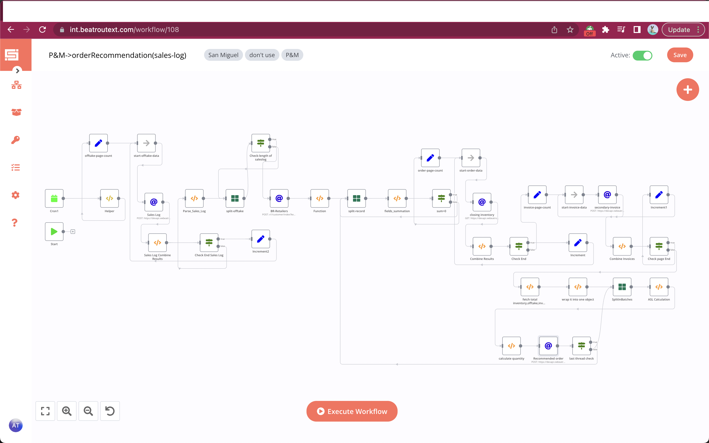

# Order Recommendation(with in-Transit)

### Feature

- [x] sync every 15 minutes(you can change it)
- [x] Fetch retailer master and sum all three custom field values to achieve `inventory cover`.
- [x] Find average daily offtake(Sales-log) and Buffer Stock .
- [x] Calculate in-transit of last 30 days and Recommended Order

### Flows

1- Fetch offtake of past 30 days:

```javascript
https://devapi.vwbeatroute.com/v1/sales-log/index?key={{$node["Helper1"].json["token"]}}&from_date={{$node["Helper1"].json["firstDayPrevMonth"]}}&to_date={{$node["Helper1"].json["filterDate"]}}&page={{$node["start-offtake-data"].data["count"] }}
```

2- Based on unique retailer (`retailer_erp_id`) grouped the offtake.

```javascript
var SalesLog = $node["Sales Log Combine Results"].json["allData"];
if (!SalesLog) {
  return [];
}
var returnData = [];
var results = SalesLog.reduce(function (results, org) {
  (results[org.retailer_erp_id] = results[org.retailer_erp_id] || []).push(org);
  return results;
}, {});
var keys = Object.keys(results);
var output = [];
keys.forEach((item) => output.push(results[item]));
output.map((item) => {
  returnData.push({
    json: {
      output: item,
    },
  });
});
```

3 - Fetch retailer based on `retailer_erp_id`

```javascript
  {{$node["Helper1"].json.brBaseUrl}}v1/customer/index?key={{$node["Helper1"].json.token}}
```

- In Body:
  ```javascript
  {
  "search": {
  "external_id":"{{$node["Check-length of saleslog"].json["output"][0]["retailer_erp_id"]}}"
  }
  }
  ```

3- Calculate inventory cover.

```javascript
var customer = $node["BR-Retailers"].json["body"]["data"]["items"][0];
if (!customer) {
  return [];
}
var returnData = [];
var customFields = [];
var sum = 0;
var value = "";
if (customer.customFields) {
  customer.customFields.forEach((cField) => {
    if(cField.labelID=="821" || cField.labelID=="822" || cField.labelID=="823"){
      (value = Number(sum) + Number(cField.value)), (sum = value);
    }
  });
}
returnData.push({
  json: {
    sum: sum,
  },
});

return returnData;
```
5 - Get Closing Inventory from this below URL:

```javascript
https://devapi.vwbeatroute.com/v1/customer/stock?key={{$node["Helper"].json["token"]}}&page={{$node["start-order-data"].json["count"]}}
```

6- Get Secondary-invoice from this below URL:
```javascript
https://devapi.vwbeatroute.com/v1/secondary-invoice?key={{$node["Helper"].json["token"]}}&from_date={{$node["Helper"].json["previousMonth"]}}&to_date={{$node["Helper"].json["now"]}} 23:59:59&page={{$node["start-invoice-data"].json["count"]}}
```
  - In Body pass data as:
  ```javascript
{
"retailer": "{{$node["split-record"].json["customer"]["id"]}}"
}
```
4- Return Invoice, Closing Quantity, Sales Log based on `sku_br_id:

```javascript
var SalesLog = $node["Sales Log"].json["data"]["items"];
var ClosingInventory =$node["Combine Results"].json["allData"];
var SecondaryInvoice =$node["Combine Invoices"].json["allData"];
var inventory_cover = $node["fields_summation"].json["sum"];
if(!SalesLog){
    return [];
}
var avg_daily_offtake = "";
var Buffer_stock = "";
var invoice_quant = 0;
var closing_qty = 0;
var result = [];
var result1 = [];
var finalOutput = [];
var duplicate_sku = [];
var returnData = [];
let allObjects = []
// Sales Log
SalesLog.forEach(sales => {
  sales.details.forEach(sku => {
     allObjects.push(sku)
      })
});

const lookup = allObjects.reduce((a, e) => {
    a[e.sku_br_id] = ++a[e.sku_br_id] || 0;
      return a;
}, {});

duplicate_sku = allObjects.filter((e) => lookup[e.sku_br_id]);
const unique = allObjects.filter((e) => !lookup[e.sku_br_id]);
duplicate_sku.forEach(function (a) {
  if (!this[a.sku_br_id]) {
    this[a.sku_br_id] = {
      sku_br_id: a.sku_br_id,
      quantity: 0
    };
    result.push(this[a.sku_br_id]);
  }
  this[a.sku_br_id].quantity += Number(a.quantity);
  this[a.sku_br_id].closing_qty = Number(closing_qty);
  this[a.sku_br_id].invoice_quant = Number(invoice_quant);
}, Object.create(null));

unique.forEach(function (a) {
  if (!this[a.sku_br_id]) {
    this[a.sku_br_id] = {
      sku_br_id: a.sku_br_id,
      quantity: 0
    };
    result1.push(this[a.sku_br_id]);
  }
  this[a.sku_br_id].quantity += Number(a.quantity);
  this[a.sku_br_id].closing_qty = Number(closing_qty);
  this[a.sku_br_id].invoice_quant = Number(invoice_quant);
}, Object.create(null));

result.map((item) => finalOutput.push(item));
result1.map((item) => finalOutput.push(item));
finalOutput.forEach((sku) => {

  ClosingInventory.forEach((invent) => {
     if (invent.sku_br_id == sku.sku_br_id) {
      sku.closing_qty += parseInt(invent.closing_qty);
    }
  });
  var quant = 0
  SecondaryInvoice.forEach((invoice) => {
    if (invoice.status == 1) {
      invoice.details.forEach((detail) => {
        if (detail.sku_erp_id == sku.sku_br_id) {
         quant = quant + Number(detail.quantity);
        }
      });
    }
  });
   sku.invoice_quant = quant
});
returnData.push({
       json:{
          finalOutput,
          }
     })
       
return returnData;
```

5- Calculate ASL as:

```javascript
var SalesLog = $node["SplitInBatches"].json['customer'];
var inventory_cover = $node["fields_summation"].json["sum"];  
if(!SalesLog){
    return [];
}

var returnData = [];
var avg_daily_offtake="";
var Buffer_stock="";
let allObjects = []
   avg_daily_offtake=SalesLog.quantity / 7;
      Buffer_stock=avg_daily_offtake* inventory_cover
    returnData.push({
                      json: {
                           "customer_erp_id":SalesLog.customer_erp_id,
                            "sku_br_id":SalesLog.sku_br_id,
                            "quantity":Math.ceil(Buffer_stock),
                             "closing_qty": SalesLog.closing_qty,
                            "invoice_quant": SalesLog.invoice_quant                             
                            }
              })
 

return returnData;
```

6 - Save Recommended order using below api:

```javascript

https://devapi.vwbeatroute.com/v1/secondary-order/update-recommended-qty??key={{$node["Helper1"].json["token"] }}
```

## Workflow

[On Click on this, you will be redirected to workflow](https://int.beatroutext.com/workflow/108)



