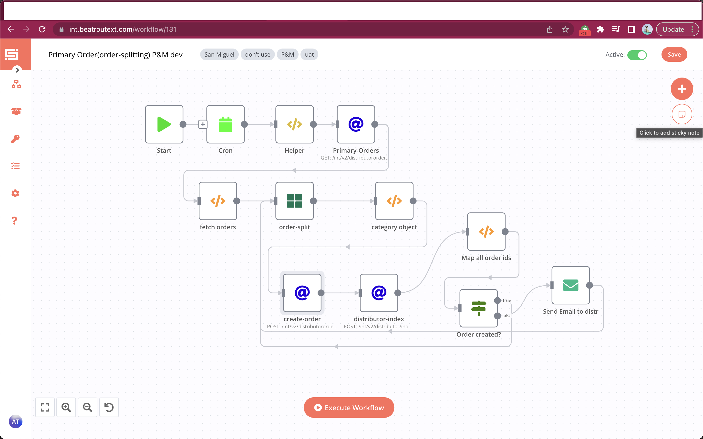

# Primary-Order Splitting

### Feature

- [x] sync every 2 minutes(you can change it)
- [x] Split the orders according to its sku_category_br_id.
- [x] Push the orders as new order in order-create api.
- [x] Send emails to its respective distributor.

### Flows

1- Fetch all orders using below api:
```javascript

{{$node["Helper"].json.brBaseUrl}}/int/v2/distributororder/index?key={{$node["Helper"].json["token"]}}&last_synced_date={{$node["Helper"].json["current"]}}
```
2 - Using `Function node` return only those order who passes from this criteria.
   > whose details length is greater than 1.
   
   > order external order must be empty.
   
   > All sku_category_br_id should not shares same value(Duplicate data)
   
3- Split the order based on sku_category_br_id.
```javascript
function getOrderTime(date){
var scheduleMinGap = 2;

var dateUTC = new Date(date);
var dateUTC = dateUTC.getTime() 
var dateIST = new Date(dateUTC);
dateIST.setHours(dateIST.getHours() + 8); 
dateIST.setMinutes(dateIST.getMinutes());

var now = dateIST.toISOString().replace('T', ' ').slice(0, -5);
return now;
}
var brSku = $node["order-split"].json["tableRecord"];
if(!brSku){
    return [];
}

var returnData = [];


const lookup = brSku.details.reduce((a, e) => {
  a[e.sku_category_br_id] = ++a[e.sku_category_br_id] || 0;
  return a;
}, {});

function getUniqueKey(object) {
  return Object.keys(object).filter((key) => object[key] === 0);
}
function getDuplicateKey(object) {
  return Object.keys(object).filter((key) => object[key] !== 0);
}


const unique = getUniqueKey(lookup);
const nonUnique = getDuplicateKey(lookup);

var newOrder = [];
var newRequirement = {
      "retailer_external_id": brSku.retailer_external_id,
       "distributor_external_id": brSku.distributor_external_id,
        "added_by": brSku.added_by,
        "status":brSku.status,
        "added_by_br_id": brSku.added_by_br_id,
        "added_by_emp_role_id": brSku.added_by_emp_role_id,
        "added_by_name": brSku.added_by_name,
        "ship_to_state":brSku.ship_to_state,
        "value": brSku.value,
        "source": brSku.source,
        "remarks": brSku.remarks,
        "ship_to_country": brSku.ship_to_country,
        "ship_to_br_id": brSku.ship_to,
        "influencer_br_id": brSku.influencer,
        "type": brSku.type,
        "order_value" : "",
        "order_date" : brSku.dateTime,
        "hasReturns" : brSku.hasReturns,
         "customField":brSku.customFields.map(items=>items.id==597&&items.value!==""?{...items,value:getOrderTime(items.value)}:items.id==598&&items.value!==""?{...items,value:getOrderTime(items.value)}:items),
          "details": {
              "item": []
            }
};
if (nonUnique.length === 0) {
brSku.details.map((obj, i) => {
    if (i !== 0) {
            var item = {
                   "retailer_external_id": brSku.retailer_external_id,
                   "distributor_external_id": brSku.distributor_external_id,
                    "added_by": brSku.added_by,
                    "status":brSku.status,
                    "added_by_br_id": brSku.added_by_br_id,
                    "added_by_emp_role_id": brSku.added_by_emp_role_id,
                    "added_by_name": brSku.added_by_name,
                    "ship_to_state":brSku.ship_to_state,
                    "value": brSku.value,
                    "source": brSku.source,
                    "remarks": brSku.remarks,
                    "ship_to_country": brSku.ship_to_country,
                    "ship_to_br_id": brSku.ship_to,
                    "influencer_br_id": brSku.influencer,
                    "type": brSku.type,
                    "order_value" : "",
                    "order_date" : brSku.dateTime,
                    "hasReturns" : brSku.hasReturns,
                     "customField":brSku.customFields.map(items=>items.id==597&&items.value!==""?{...items,value:getOrderTime(items.value)}:items.id==598&&items.value!==""?{...items,value:getOrderTime(items.value)}:items),
                    details: {
                       item: {
                          discount: obj.discount,
                          base_price: obj.base_price,
                          quantity: obj.quantity,
                          sku_category_br_id: obj.sku_category_br_id,
                          sku_external_id: obj.sku_external_id,
                          skuPrice: obj.price,
                          sku_uom: obj.sku_uom,
                          dispatchedQty:obj.dispatchedQty,
                          api_remarks:obj.api_remarks,
                          taxRate: obj.taxRate,
                          price: obj.price,
                          taxBillingValue: obj.taxBillingValue,
                          }
                       },
              };
             newOrder.push(item);
             
            const quantityUpdate1 = {
                  discount: obj.discount,
                  base_price: obj.base_price,
                  remove:"1",
                  sku_category_br_id: obj.sku_category_br_id,
                  sku_external_id: obj.sku_external_id,
                  sku_value: obj.skuPrice,
                  taxRate: obj.taxRate,
                  taxBillingValue: obj.taxBillingValue,
                  sku_uom: obj.sku_uom,
                  api_remarks:obj.api_remarks,
                  price: obj.price
                    };
           newRequirement.orderId = brSku.orderId;
           newRequirement.details.item.push(quantityUpdate1);
       } else {
                  const quantityUpdate1 = {
                  discount: obj.discount,
                  base_price: obj.base_price,
                  quantity: obj.quantity,
                  sku_category_br_id: obj.sku_category_br_id,
                  sku_external_id: obj.sku_external_id,
                  sku_value: obj.skuPrice,
                  taxRate: obj.taxRate,
                  taxBillingValue: obj.taxBillingValue,
                  sku_uom: obj.sku_uom,
                  api_remarks:obj.api_remarks,
                  price: obj.price
                };
        newRequirement.details.item.push(quantityUpdate1);
      }
      });
} else {
 if (unique.length === 0) {
    var filtered = brSku.details.filter(
      (item) => item.sku_category_br_id !== getDuplicateKey(lookup)[0]
    );
    var results = filtered.reduce(function (results, item) {
      (results[item.sku_category_br_id] =
        results[item.sku_category_br_id] || []).push(item);
      return results;
    }, {});

    Object.keys(results).map(function (key, index) {
      var item = {
       "retailer_external_id": brSku.retailer_external_id,
       "distributor_external_id": brSku.distributor_external_id,
        "added_by": brSku.added_by,
        "status":brSku.status,
        "added_by_br_id": brSku.added_by_br_id,
        "added_by_emp_role_id": brSku.added_by_emp_role_id,
        "added_by_name": brSku.added_by_name,
        "ship_to_state":brSku.ship_to_state,
        "value": brSku.value,
        "type": brSku.type,
        "source": brSku.source,
        "remarks": brSku.remarks,
        "ship_to_country": brSku.ship_to_country,
        "ship_to_br_id": brSku.ship_to,
        "influencer_br_id": brSku.influencer,
        "order_value" : "",
        "order_date" : brSku.dateTime,
        "hasReturns" : brSku.hasReturns,
          "customField":brSku.customFields.map(items=>items.id==597&&items.value!==""?{...items,value:getOrderTime(items.value)}:items.id==598&&items.value!==""?{...items,value:getOrderTime(items.value)}:items),
        details: results[key]
      };
      newOrder.push(item);
    });
  brSku.details.map((obj, i) => {
     if (obj.sku_category_br_id == getDuplicateKey(lookup)[0]) {
      const quantityUpdate1 = {
        discount: obj.discount,
        base_price: obj.base_price,
        quantity: obj.quantity,
        sku_category_br_id: obj.sku_category_br_id,
        sku_external_id: obj.sku_external_id,
        sku_value: obj.skuPrice,
        taxRate: obj.taxRate,
        taxBillingValue: obj.taxBillingValue,
        sku_uom: obj.sku_uom,
        api_remarks:obj.api_remarks,
        price: obj.price
      };
      newRequirement.orderId = brSku.orderId;
      newRequirement.details.item.push(quantityUpdate1);
     
    } else {
      const quantityUpdate1 = {
        discount: obj.discount,
        base_price: obj.base_price,
        remove:"1",
        sku_category_br_id: obj.sku_category_br_id,
        sku_external_id: obj.sku_external_id,
        sku_value: obj.skuPrice,
        taxRate: obj.taxRate,
        taxBillingValue: obj.taxBillingValue,
        sku_uom: obj.sku_uom,
        api_remarks:obj.api_remarks,
        price: obj.price
      };
      newRequirement.details.item.push(quantityUpdate1);
    }
  });
  }
  else {
     var filtered = brSku.details.filter(
      (item) => item.sku_category_br_id !== getDuplicateKey(lookup)[0]
    );
    var results = filtered.reduce(function (results, item) {
      (results[item.sku_category_br_id] =
        results[item.sku_category_br_id] || []).push(item);
      return results;
    }, {});

    Object.keys(results).map(function (key, index) {
      var item = {
        "retailer_external_id": brSku.retailer_external_id,
           "distributor_external_id": brSku.distributor_external_id,
           "added_by": brSku.added_by,
           "status":brSku.status,
           "order_value" : "",
           "added_by_br_id": brSku.added_by_br_id,
          "added_by_emp_role_id": brSku.added_by_emp_role_id,
          "added_by_name": brSku.added_by_name,
          "ship_to_state":brSku.ship_to_state,
          "value": brSku.value,
          "type": brSku.type,
          "source": brSku.source,
          "remarks": brSku.remarks,
          "ship_to_br_id": brSku.ship_to,
          "influencer_br_id": brSku.influencer,
          "ship_to_country": brSku.ship_to_country,
         "order_date" : brSku.dateTime,
          "hasReturns" : brSku.hasReturns,
           "customField":brSku.customFields.map(items=>items.id==597?{...items,value:getOrderTime(items.value)}:items.id==598?{...items,value:getOrderTime(items.value)}:items),
          details: results[key]
      };
      newOrder.push(item);
    });
    brSku.details.map((obj, i) => {
        if (unique.includes(obj.sku_category_br_id)) {
              const quantityUpdate1 = {
            discount: obj.discount,
            base_price: obj.base_price,
            remove:"1",
            sku_category_br_id: obj.sku_category_br_id,
            sku_external_id: obj.sku_external_id,
            sku_value: obj.skuPrice,
            taxRate: obj.taxRate,
            taxBillingValue: obj.taxBillingValue,
            sku_uom: obj.sku_uom,
            api_remarks:obj.api_remarks,
            price: obj.price
          };
           newRequirement.orderId = brSku.orderId;
          newRequirement.details.item.push(quantityUpdate1);
        } else {
          if (obj.sku_category_br_id == getDuplicateKey(lookup)[0]) {
          const quantityUpdate1 = {
            discount: obj.discount,
            base_price: obj.base_price,
            sku_category_br_id: obj.sku_category_br_id,
            sku_external_id: obj.sku_external_id,
            sku_value: obj.skuPrice,
            taxRate: obj.taxRate,
            taxBillingValue: obj.taxBillingValue,
            sku_uom: obj.sku_uom,
            quantity: obj.quantity,
            api_remarks:obj.api_remarks,
            price: obj.price
          };
          newRequirement.details.item.push(quantityUpdate1);
          }else{
          const quantityUpdate1 = {
            discount: obj.discount,
            base_price: obj.base_price,
            remove:"1",
            sku_category_br_id: obj.sku_category_br_id,
            sku_external_id: obj.sku_external_id,
            sku_value: obj.skuPrice,
            taxRate: obj.taxRate,
            taxBillingValue: obj.taxBillingValue,
            sku_uom: obj.sku_uom,
            api_remarks:obj.api_remarks,
            price: obj.price
          };
          newRequirement.details.item.push(quantityUpdate1);
        }
        }
    });
  }
  }

newOrder.push(newRequirement);
 returnData.push({
        "json":{
         "data":newOrder,
        },
             

  });

             
return returnData;
```
4- Create Order using below api:
```javascript
{{$node["Helper"].json["brBaseUrl"]}}/int/v2/distributor/index?key={{$node["Helper"].json["token"]}}
```
5- Send Email to its respective Distributor

## Workflow

[On Click on this, you will be redirected to workflow](https://int.beatroutext.com/workflow/131)

