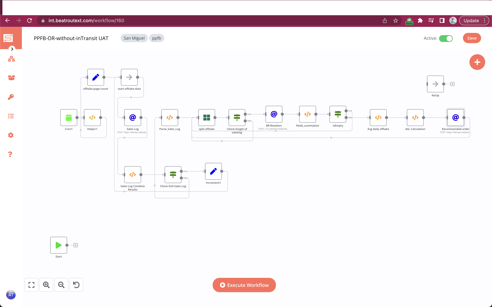

# Order Recommendation(without in-Transit)

### Feature

- [x] sync every 10 minutes(you can change it)
- [x] Fetch offtake (sales log) of last 1 month and calculate avg offtake quantity..
- [x]Get inventory cover and find ASL and calculate Recommended order .

### Flows

1- Fetch offtake of past 30 days:
```javascript

https://devapi.vwbeatroute.com/v1/sales-log/index?key={{$node["Helper1"].json["token"]}}&from_date={{$node["Helper1"].json["firstDayPrevMonth"]}}&to_date={{$node["Helper1"].json["filterDate"]}}&page={{$node["start-offtake-data"].data["count"] }}
```

2- Based on unique retailer (`retailer_erp_id`) grouped the offtake.
```javascript
var SalesLog = $node["Sales Log Combine Results"].json["allData"];
if(!SalesLog){
    return [];
}
var returnData = [];
var results = SalesLog.reduce(function(results, org) {
   (results[org.retailer_erp_id] = results[org.retailer_erp_id] || []).push(org);
    return results;
}, {})
var keys = Object.keys(results)
var output = []
keys.forEach(item=>output.push(results[item]))
output.map(item=>{
  returnData.push({
         json: {
           "output": item
         }
  })
});
```

3 - Fetch retailer based on `retailer_erp_id`
  ```javascript
    {{$node["Helper1"].json.brBaseUrl}}v1/customer/index?key={{$node["Helper1"].json.token}}
```
   - In Body:
        ```javascript
        {
        "search": {
        "external_id":"{{$node["Check-length of saleslog"].json["output"][0]["retailer_erp_id"]}}"
        }
        }
        ```
   
3- Calculate inventory cover.

```javascript
var customer = $node["BR-Retailers"].json["body"]["data"]["items"][0];
if(!customer){
    return [];
}
var returnData = [];
var customFields = [];
var sum = 0;
var value=""
    if(customer.customFields){
        customer.customFields.forEach(cField => {
        if(cField.labelID=="824" || cField.labelID=="825" || cField.labelID=="826"){
                value= Number(sum) + Number(cField.value),
                sum= value
         
            }
        });
    }
 returnData.push({
        json: {
        "sum":sum
        }
        })

return returnData;

```
4- Calculate Average Daily Offtake:
```javascript
var SalesLog = $node["split-offtake"].json["output"];
var inventory_cover = $node["fields_summation"].json["sum"];
if(!SalesLog){
    return [];
}
var returnData = [];
var finalOutput = [];
var finalData=[];
var avg_daily_offtake="";
var ASL="";
let allObjects = []
SalesLog.map(item=>{
  item.details.map(list=>{
     return(
        allObjects.push(list)
     )
  })
})
function getUniqueKey(object) {
  return Object.keys(object).filter((key) => object[key] === 0);
}
function getDuplicateKey(object) {
  return Object.keys(object).filter((key) => object[key] !== 0);
}

  let lookup = allObjects.reduce((a, e) => {
    a[e.sku_br_id] = ++a[e.sku_br_id] || 0;
      return a;
}, {});

// const unique = getUniqueKey(lookup);
 let duplicate_sku = allObjects.filter(e => 
      lookup[e.sku_br_id]
  )
  let unique = allObjects.filter(e => 
      !lookup[e.sku_br_id]
  )
//let duplicate_sku = getDuplicateKey(lookup)
        
var  result = [];
if(duplicate_sku.length>1){
  duplicate_sku.forEach(function (a) {
    if (!this[a.sku_br_id]) {
        this[a.sku_br_id] = { sku_br_id: a.sku_br_id, quantity: 0, customer_erp_id:SalesLog[0].retailer_erp_id,inventory_cover:inventory_cover};
        result.push(this[a.sku_br_id]);
    }
    this[a.sku_br_id].quantity += Number(a.quantity);
    this[a.sku_br_id].inventory_cover = Number(inventory_cover);
  }, Object.create(null));
  if (unique.length > 0) {
     unique.forEach(sku => {
          finalOutput.push({
                          "customer_erp_id":SalesLog[0].retailer_erp_id,
                          "sku_br_id":sku.sku_br_id,
                          "quantity": sku.quantity,
                          "inventory_cover":inventory_cover
                          
                        })   
  })
}

finalOutput.map(item=>finalData.push(item))
result.map(item=>finalData.push(item)) 
   returnData.push({
                json: {
                   "lookup":finalOutput
                            
  }
  })
  
  }else{
  SalesLog.forEach(sales => {
  sales.details.forEach(sku => {
          finalOutput.push({
                          "customer_erp_id":sales.retailer_erp_id,
                          "sku_br_id":sku.sku_br_id,
                          "quantity": sku.quantity,
                           "inventory_cover":inventory_cover
                        })
             
         })
  })
   returnData.push({
                json: {
                   "lookup":finalOutput
                            
  }
  })
  }
return returnData;
```

5- Calculate ASL as:
``` javascript
var lookup= $node["Avg daily offtake"].json["lookup"]
if(!lookup){
    return [];
}
var returnData = [];
var avg_daily_offtake="";
var ASL="";
var Recommended_Order="";
var final_quant = 0;
let allObjects = []
lookup.forEach(SalesLog=>{
              avg_daily_offtake = SalesLog.quantity / 1;
              ASL=avg_daily_offtake * SalesLog.inventory_cover
              Recommended_Order = ASL
              if(Recommended_Order>=0){
              final_quant=Recommended_Order
              }else{
              final_quant=0
              }
             returnData.push({
                      json: {
                           "customer_erp_id":SalesLog.customer_erp_id,
                            "sku_br_id":SalesLog.sku_br_id,
                             "quantity":Math.ceil(final_quant),
                             "ASL":ASL,
                             "inventory":SalesLog.inventory_cover
                            }
              })
 
})

return returnData;

```

6 - Save Recommended order using below api:
```javascript

https://devapi.vwbeatroute.com/v1/secondary-order/update-recommended-qty??key={{$node["Helper1"].json["token"] }}
```

## Workflow

[On Click on this, you will be redirected to workflow](https://int.beatroutext.com/workflow/160)


